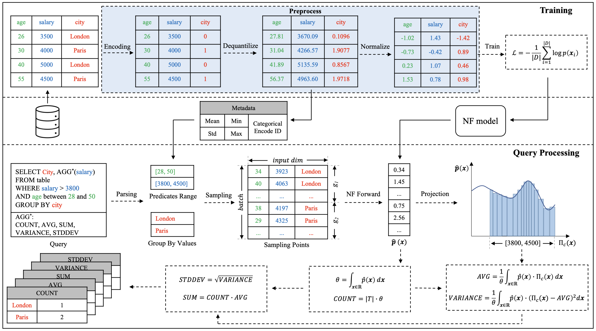

# NFAQP

This repo is the implementation of NFAQP, a normalizing flow-based AQP approach. Our Paper "Normalizing FLow based Approximate Query Processing" is accepted by [Advanced Data Mining and Applications (ADMA) 2023](https://adma2023.uqcloud.net)

